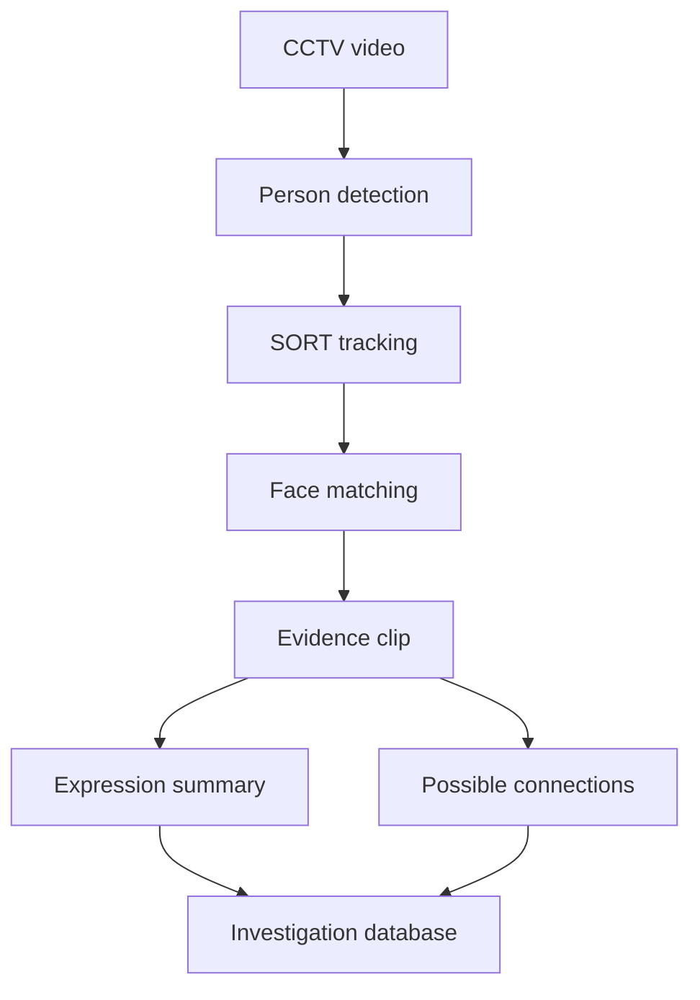

# AI-Assisted CCTV for Police Investigations

Research prototype for turning CCTV footage into structured investigative leads. The system combines person detection, multi-object tracking, face matching, evidence-clip generation, facial-expression analysis, and relationship discovery across recorded scenes.

> [!IMPORTANT]
> This is an award-winning research prototype, not a production policing system. It must not be used to identify, accuse, or make decisions about people without lawful authority, human review, and independent verification.

## Recognition

- **Silver Medal, Indonesian Student Research Olympiad (OPSI) 2023** — ranked **4th of 671 teams**. Issued by the Indonesian Ministry of Education, Culture, Research, and Technology (Kemendikbudristek).
- **International Science and Engineering Fair (ISEF) Delegate National Selection** — **top 16 of 4,348 teams**. Issued by the Indonesian Ministry of Education, Culture, Research, and Technology (Kemendikbudristek).

## What the prototype does

1. Detects people in video using a trained YOLO model.
2. Assigns persistent track identifiers using Simple Online and Realtime Tracking (SORT).
3. Compares detected faces with enrolled target images.
4. Records an evidence clip when a target is detected.
5. Estimates the distribution of facial expressions in the clip.
6. Searches the same clip for other faces and stores possible connections.



## Repository layout

| Path | Purpose |
| --- | --- |
| `src/ai_cctv/` | Application source code and analysis pipeline |
| `scripts/enroll_target.py` | Utility for enrolling a reference image |
| `models/checkpoints/` | Four trained model checkpoints from the research process |
| `data/` | Runtime coordinate data; generated content is ignored by Git |
| `outputs/` | Generated raw clips, evidence videos, and face crops |
| `docs/` | Architecture, setup notes, limitations, and research-paper checklist |
| `pyproject.toml` | Python package metadata and build configuration |
| `requirements.txt` | Runtime dependencies |

## Setup

The original prototype was developed with Python, MySQL, OpenCV, and a camera input. Some dependencies—especially `face-recognition`—may require operating-system packages before installation.

```bash
python -m venv .venv
source .venv/bin/activate
python -m pip install --upgrade pip
python -m pip install -r requirements.txt
python -m pip install --no-deps -e .
cp .env.example .env
```

Create the database tables described in [`docs/SETUP.md`](docs/SETUP.md), update `.env`, and then run:

```bash
python -m ai_cctv.main
```

The default camera index is `2`, matching the original experiment. Change `CAMERA_SOURCE` in `.env` if your camera or video source differs.

## Research status and reproducibility

The repository contains the prototype code and trained checkpoints, but it does **not yet contain enough information to reproduce the reported research results**. The paper should be added before this repository is presented as a complete research artifact. In particular, the repository still needs:

- the paper and complete author list;
- dataset collection, annotation, and consent details;
- model classes, training settings, and checkpoint-selection criteria;
- train, validation, and test splits;
- evaluation metrics, baselines, uncertainty, and failure cases;
- hardware and software versions used in the experiments.

## Responsible-use limitations

Face matching and expression classification can be wrong, especially under poor lighting, occlusion, low resolution, pose changes, or domain shift. Expression labels are not reliable evidence of intent, truthfulness, guilt, or mental state. Outputs should be treated only as uncertain search aids and must be reviewed against the original footage.

Before any real-world deployment, the system needs privacy and legal review, demographic performance testing, calibrated thresholds, access controls, audit logs, retention rules, and a documented human-appeal process.

## Acknowledgements

Multi-object tracking is based on the [SORT algorithm by Alex Bewley and collaborators](https://github.com/abewley/sort). The pipeline also uses Ultralytics YOLO, OpenCV, `face-recognition`, and DeepFace. See [`THIRD_PARTY_NOTICES.md`](THIRD_PARTY_NOTICES.md).

## Citation

Please cite the research paper when it is added to this repository. A formal `CITATION.cff` file should be created from the paper’s exact title, author order, year, and publication details rather than guessed from the repository name.
